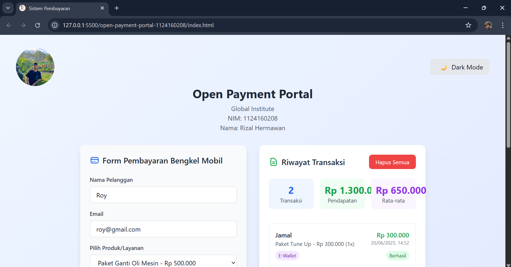
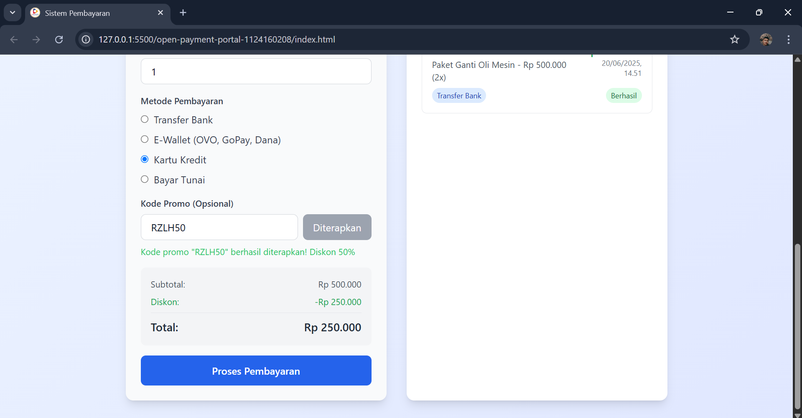
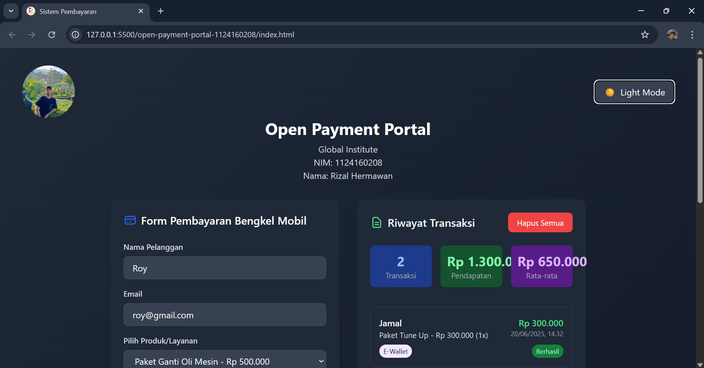
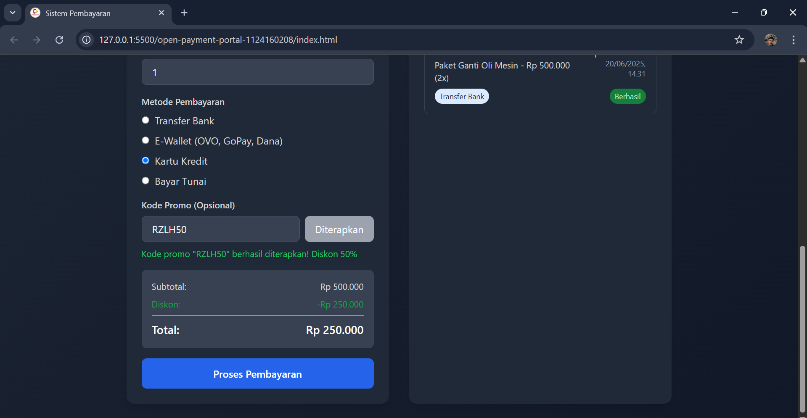

# <div align="center">UAS Perancangan Web</div>
<div align="center">
  <p>Dosen Pengajar: <a href="https://github.com/iketutg">I Ketut Gunawan</a></p>
  <p><em>"Repository ini dibuat untuk mengumpulkan dan mengelola tugas-tugas Ujian Akhir Semester"
</em></p>
</div>

## 👨‍💻 Profil

- Nama  : Rizal Hermawan
- NIM   : 1124160208
- Kelas : TI 24 SE 3

## 📸 Screenshots
Terang :
<div align="center">
  
  <p><em>Screenshot Mode Terang 1</em></p>
</div>

<div align="center">
  
  <p><em>Screenshot Mode Terang 2</em></p>
</div>

Gelap :
<div align="center">
  
  <p><em>Screenshot Mode Gelap 1</em></p>
</div>

<div align="center">
  
  <p><em>Screenshot Mode Gelap 2</em></p>
</div>

## 🏗️ Struktur Proyek

```
open-payment-portal-1124160208/
├── assets/
│   ├── img/
│       ├── logo.png
        ├── me.jpg
        ├── ss-dr1.png
        ├── ss-dr2.png
        ├── ss-lg1.png
│       └── ss-lg1.png
├── index.html
├── README.md
└── script.js
```

## 🎁 Kode Promo
Berbagai Kode Promo yang bisa dipakai:
- RZLH50 = Untuk Mendapatkan Diskon 50%
- SPA555 = Untuk Mendapatkan Diskon 5%
- SV200K = Untuk Mendapatkan Diskon Sebesar Rp 200.000
- NEWUSR = Untuk Mendapatkan Diskon Sebesar Rp 100.000
- NWYEAR = Untuk Mendapatkan Diskon Sebesar Rp 50.000

## 🛠️ Teknologi Digunakan
- HTML5, CSS3
- Tailwind CSS CDN
- JavaScript (Vanilla)

## 🚀 Fitur Utama

- 🔄 **Form Pembayaran Interaktif**  
  Input nama, email, pilihan menu, jumlah, dan metode pembayaran.

- 💰 **Kalkulasi Otomatis**  
  Hitung subtotal, diskon dari kode promo, dan total pembayaran secara dinamis.

- 📊 **Riwayat Transaksi**  
  Menampilkan semua transaksi yang telah dilakukan lengkap dengan statistik:
  - Total transaksi
  - Total pendapatan
  - Rata-rata transaksi

- 💡 **Dark Mode**  
  Toggle untuk mengubah tema terang ↔ gelap (dengan penyimpanan preferensi).

- 🧹 **SweetAlert Hapus Semua**  
  Konfirmasi penghapusan riwayat transaksi dengan SweetAlert2.

- 🧾 **Modal Konfirmasi Pembayaran**  
  Setelah transaksi berhasil, detail pembayaran ditampilkan dalam modal.