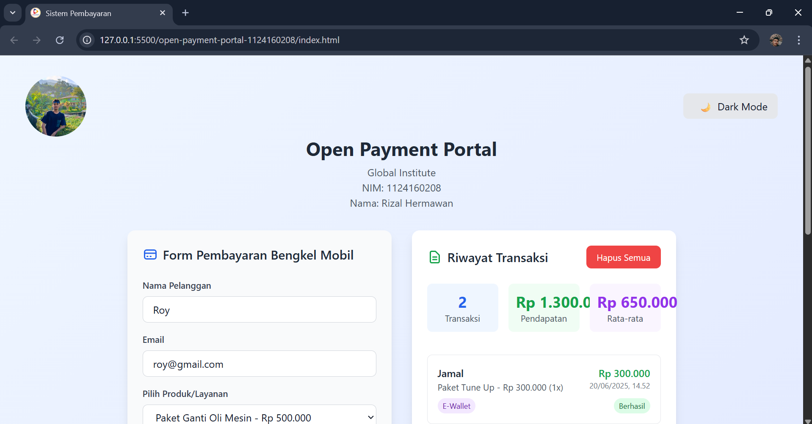
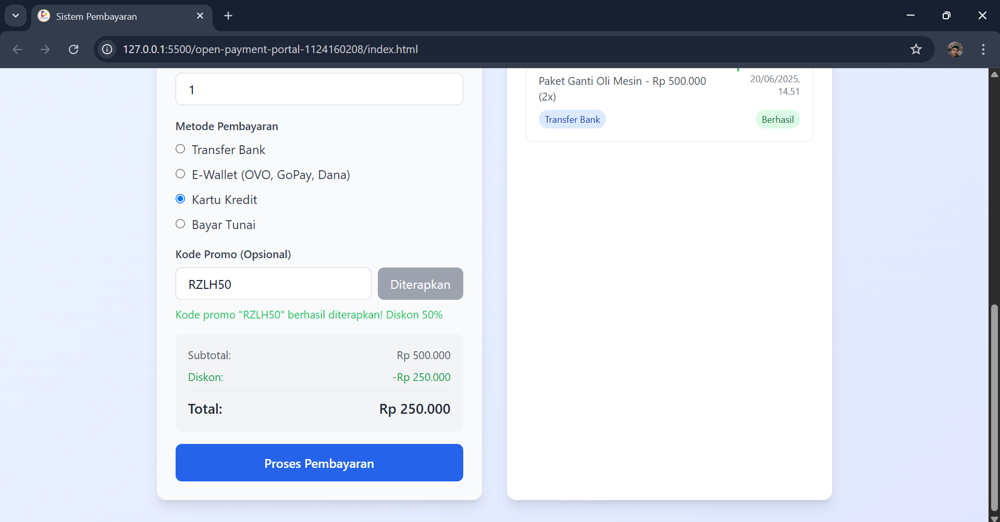

# <div align="center">UAS Perancangan Web</div>
<div align="center">
  <p>Dosen Pengajar: <a href="https://github.com/iketutg">I Ketut Gunawan</a></p>
  <p><em>"Repository ini dibuat untuk mengumpulkan dan mengelola tugas-tugas Ujian Akhir Semester"
</em></p>
</div>

## 👨‍💻 Profil

- Nama  : Rizal Hermawan
- NIM   : 1124160208

## 📸 Screenshots
Terang :
<div align="center">
  
  <p><em>Screenshot Mode Terang 1</em></p>
</div>

<div align="center">
  
  <p><em>Screenshot Mode Terang 2</em></p>
</div>

Gelap :
<div align="center">
  
  <p><em>Screenshot Mode Gelap 1</em></p>
</div>

<div align="center">
  
  <p><em>Screenshot Mode Gelap 2</em></p>
</div>

## 🏗️ Struktur Proyek

```
open-payment-portal-1124160208/
├── assets/
│   ├── img/
│       ├── logo.png
        ├── me.jpg
        ├── ss-dr1.png
        ├── ss-dr2.png
        ├── ss-lg1.png
│       └── ss-lg1.png
├── index.html
├── README.md
└── script.js
```
